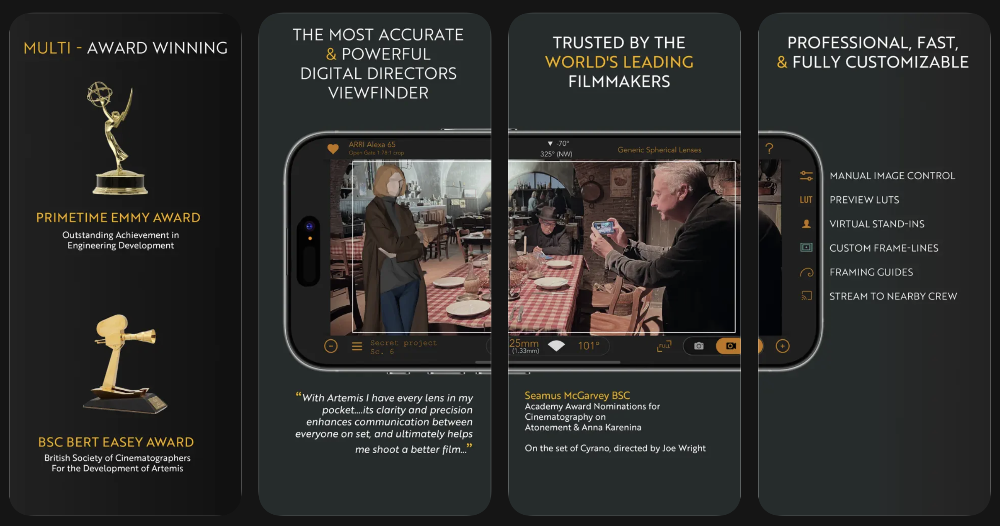
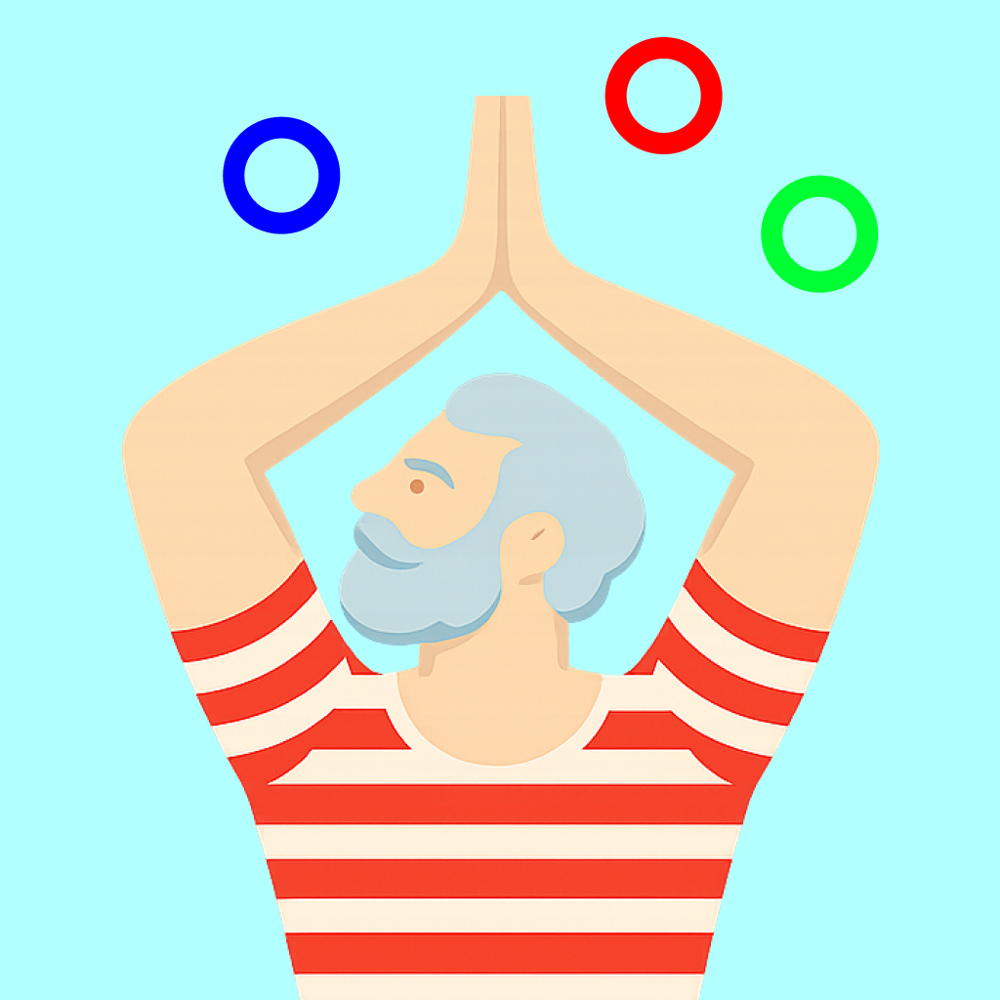
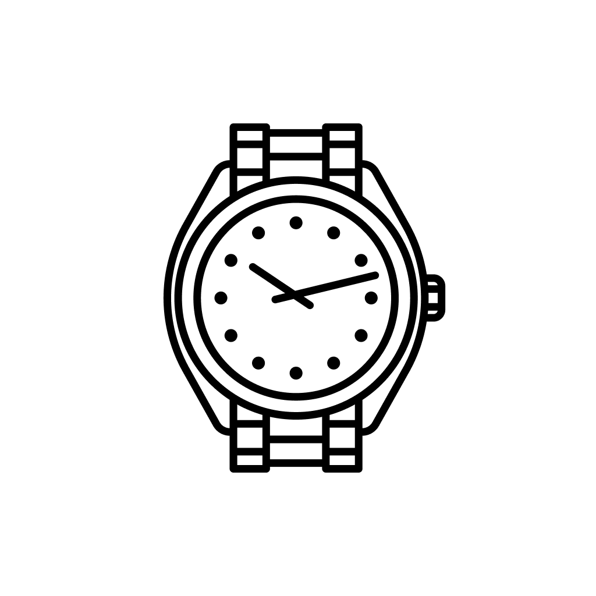

## Client work

**[Artemis Pro](https://apps.apple.com/us/app/artemis-directors-viewfinder/id1164523253)**
Professional filmmaking app for cinematographers and directors to preview shots using real camera and lens data.

 
 

**[Hodinkee](https://apps.apple.com/us/app/hodinkee/id1008305274)**
Through strategic partnerships and in-app features, we helped Hodinkee monetize untapped spaces and increase revenue. Additionally, our proactive integration of native iOS features, such as Widgets, Siri Shortcuts, and Dark Mode, ensured that the Hodinkee app remained a top choice for iOS users in the competitive world of luxury watch media.

  

## We also design & develop our own applications!

<table>
  <tr>
    <td><b>App Title</b></td>
    <td><b>Logo</b></td>
    <td><b>Description</b></td>
  </tr>
  <tr>
    <td><a href="https://apps.apple.com/us/app/childish-folly/id6747728050">Childish Folly</a></td>
    <td></td>
    <td>The Severance ring toss game - Miss Huang approved for unwinding or testing your precision.</td>
  </tr>
  <tr>
    <td><a href="https://lagreebuddy.com">Lagree Buddy Metronome</a></td>
    <td></td>
    <td>Lagree Buddy is your partner on the Megaformer. It keeps you moving slow and strong throughout class.</td>
  </tr>
  <tr>
    <td><a href="https://apps.apple.com/us/app/id6670567397">spf.today</a></td>
    <td></td>
    <td>spf.today makes sunscreen fun by using Apple Health's Time in Daylight tracking!</td>
  </tr>
  <tr>
    <td><a href="https://apps.apple.com/us/app/wristcheck-try-on/id6737742550">WristCheck Try-On</a></td>
    <td></td>
    <td>WristCheck is your virtual 3D Horological Experience! Explore the magic of the Vision Pro and try-on some luxury watches.</td>
  </tr>
</table>

 
 
