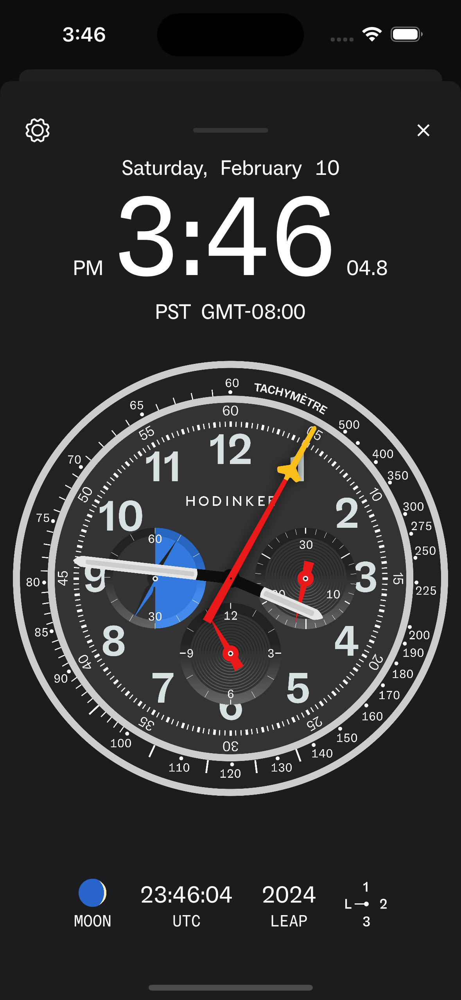
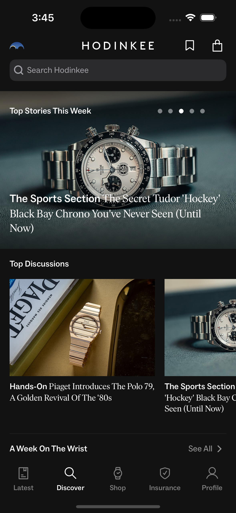

## Client work

**[Hodinkee](https://apps.apple.com/us/app/hodinkee/id1008305274)**  
Through strategic partnerships and in-app features, we helped Hodinkee monetize untapped spaces and increase revenue. Additionally, our proactive integration of native iOS features, such as Widgets, Siri Shortcuts, and Dark Mode, ensured that the Hodinkee app remained a top choice for iOS users in the competitive world of luxury watch media.

  

 
 

**[Azure Coffee Roasters](https://www.azurecoffeeroasters.com)**  
We transformed Azure's online presence with a new website featuring a wholesale section, subscription options, and smooth integration with their Square POS system. This upgraded platform showcases their passion for quality coffee while providing a simplified, enjoyable experience for customers.

 
 

## We also design and develop our own applications

**[Pixelfits](https://apps.apple.com/us/app/id6469011331)**  
Your virtual 2D Fitting Room! Our app lets you share tops, bottoms, or sneakers from your mobile browser and "try on" anything you come across while shopping online. This app also explored more of what the iOS ecosystem has to offer with Share Extensions, SwiftData, and VisionKit.

  

 
 

**Nareta**  
COMING SOON.

 
 
