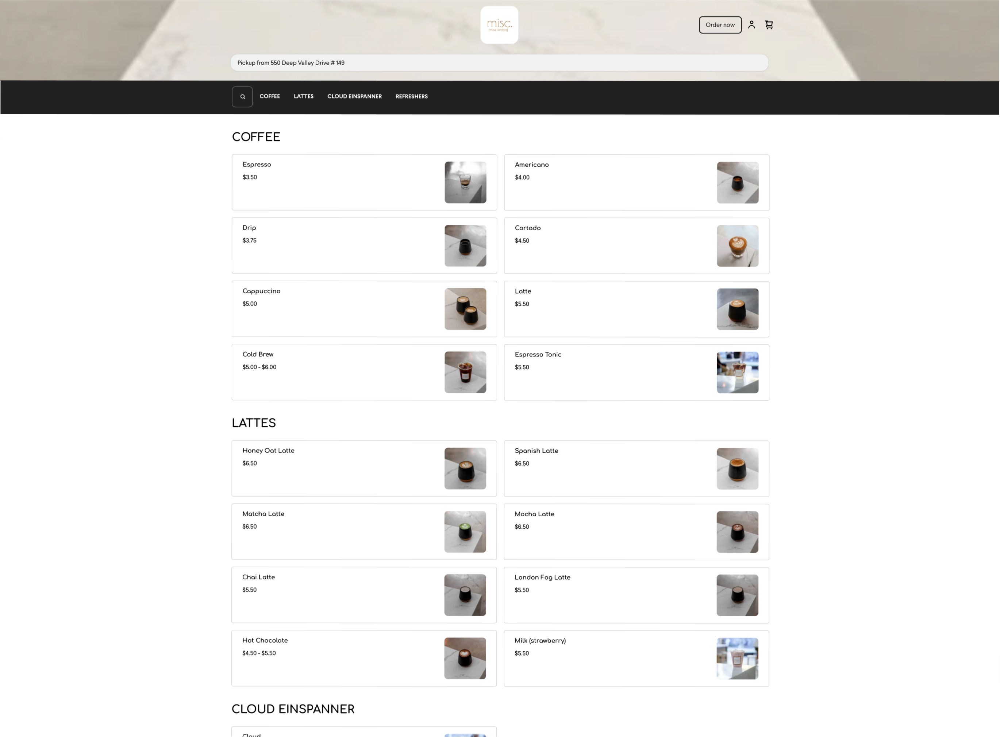
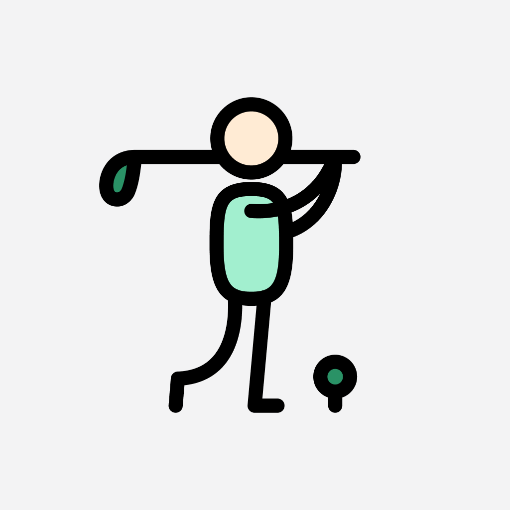

## Our client work

**[Azure Coffee Roasters](https://www.azurecoffeeroasters.com)**  
We transformed Azure's online presence with a new website featuring a wholesale section, subscription options, and smooth integration with their Square POS system. This upgraded platform showcases their passion for quality coffee while providing a simplified, enjoyable experience for customers.

 
 

**[Misc Coffee](https://misc.coffee)**  
Unlike Azure, Misc Coffee was focused on online ordering. We assisted in giving them a clean and simple layout that would help (not confuse) customers order on the go. Go check them out in the heart of Palos Verdes!

 
 

**[Hodinkee](https://apps.apple.com/us/app/hodinkee/id1008305274)**  
Through strategic partnerships and in-app features, we helped Hodinkee monetize untapped spaces and increase revenue. Additionally, our proactive integration of native iOS features, such as Widgets, Siri Shortcuts, and Dark Mode, ensured that the Hodinkee app remained a top choice for iOS users in the competitive world of luxury watch media.

  

 
 

## We also design & develop our own applications!

<table>
  <tr>    
    <th align="left">App Title</th>
    <th align="left">Logo</th>
    <th align="left">Description</th>
  </tr>
  <tr>
    <td><a href="https://apps.apple.com/us/app/id6670567397">LUX - Sunscreen Tracking Game</a></td>
    <td></td>    
    <td>LUX is an app that gamifies sunscreen by using your Apple Health's Time in Daylight metric!</td>    
  </tr>
  <tr>
    <td><a href="https://apps.apple.com/us/app/id6503170201">Hacks - Sim Golf Journal</a></td>
    <td></td>    
    <td>Hacks is an app for the golfer that wants to document their swing evolution with video, stats, and notes but not blast it all over social media.
</td>    
  </tr>
  <tr>
    <td><a href="https://apps.apple.com/us/app/id6469011331">Pixelfits - Virtual Fittings</a></td>
    <td></td>    
    <td>Pixelfits is your virtual 2D Fitting Room! Our app lets you share tops, bottoms, or sneakers from your mobile browser and "try on" anything you come across while shopping online.</td>    
  </tr>  
</table>

 
 
