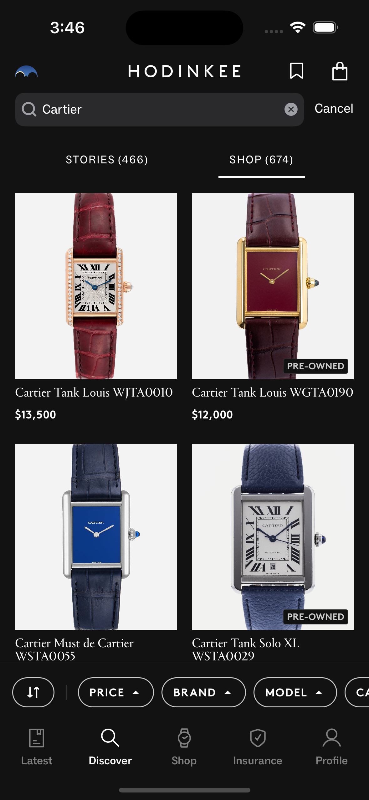

## 🧑🏻‍🔬 **Destro Labs**

**We are a bespoke apps, websites, and digital solutions provider.**  
Client work includes:

**[Hodinkee](https://apps.apple.com/us/app/hodinkee/id1008305274)**  
Write a blurb here about what Hodinkee wanted and what we helped with. Maybe just a sentence or two and that's it. Let the screenshots do the talking if possible.

    

        
    

    

        
    

    

        
    

 
 

**[Azure Coffee Roasters](https://www.azurecoffeeroasters.com)**  
Write a blurb here about what Azure wanted and what we helped with. Maybe just a sentence or two and that's it. Let the screenshots do the talking if possible.

 
 

**We also independently design and develop our own applications.**

**[Pixelfits](https://apps.apple.com/us/app/id6469011331)**  
The idea blossomed when Apple opened up its “subject lifting” API, which magically lifts subjects out of images through a touch & hold interaction.

    

        
    

    

        
    

    

        
    

 
 

**[Nareto](https://apps.apple.com/us/app/id6469011331)**  
COMING SOON.

 
 
